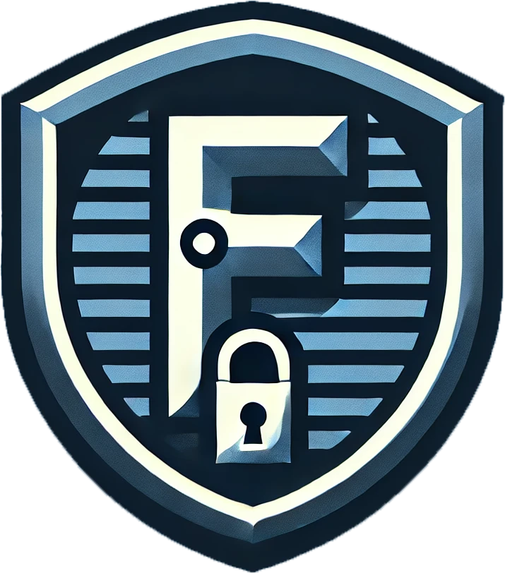
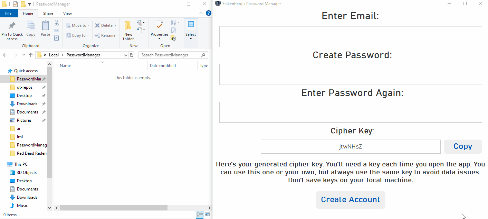
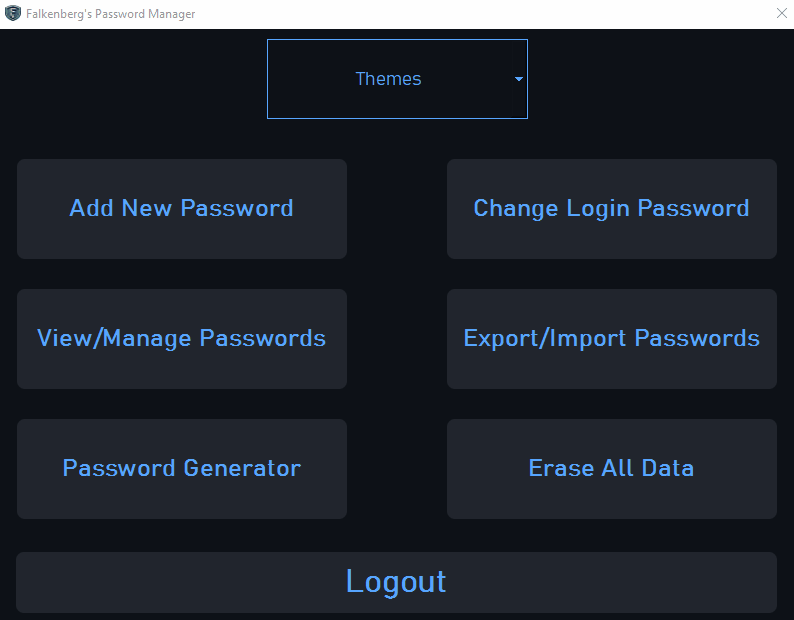
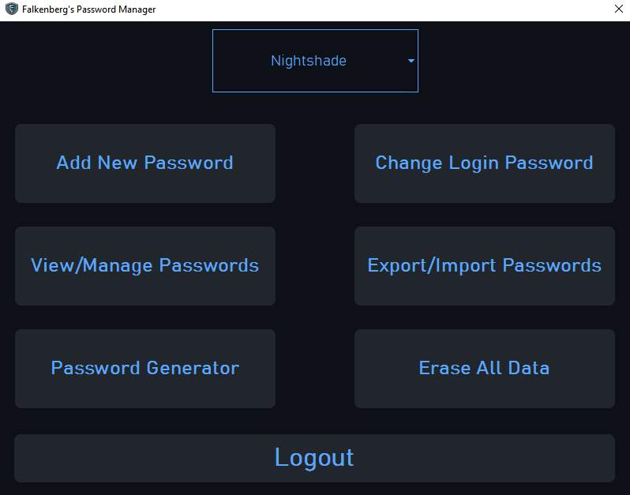
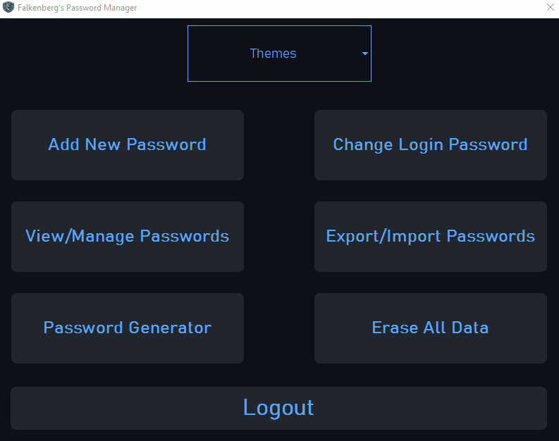
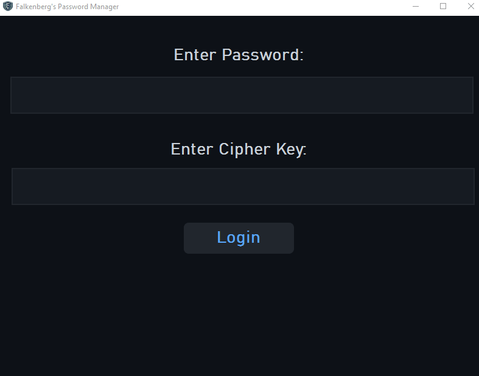

<h1 align="center">🔒 Falkenberg's Password Manager (Beta)</h1>

    

**Falkenberg's Password Manager** is a secure, lightweight, and 100% local password management solution designed for users who prioritize offline security. Operating entirely on your local machine, it ensures your passwords remain accessible even in the most challenging network conditions.

> **Note:** This application currently only works on Windows machines.

## 📑 Table of Contents

1. [Key Features](#-key-features)
    - [Purely Local & Secure](#1-purely-local--secure)
    - [Robust Encryption & Hashing](#2-robust-encryption--hashing)
    - [Strong Password Generator](#3-strong-password-generator)
    - [Simple & Intuitive Management Interface](#4-simple--intuitive-management-interface)
        - [Adding Passwords](#adding-passwords)
    - [Flexible Import/Export Options](#5-flexible-importexport-options)
        - [Exporting Your Passwords](#exporting-your-passwords)
        - [Importing Your Passwords](#importing-your-passwords)
    - [Security Features and Customization](#6-security-features-and-customization)
2. [Beta Release Notice](#-beta-release-notice)

## 🌟 Key Features

### 1. Purely Local & Secure

- **Offline Operation:** All data is stored locally on your device—no cloud storage, no remote breaches. This means that your sensitive information is never exposed to external networks or online threats, providing a higher level of security compared to remote or cloud-based password managers. With purely local storage, you eliminate the risks associated with server-side vulnerabilities, data leaks, or unauthorized access by third parties.

- **Advanced Encryption:** The password manager uses a custom XOR-based encryption algorithm paired with a unique cipher key that you generate or customize. This ensures that your data is protected by strong encryption tailored to your specific needs, making it nearly impossible for unauthorized users to decrypt your passwords without your specific key. Additionally, because the encryption and decryption processes occur entirely on your device, you have complete control over your data, further reducing the risk of external attacks or data exposure.

### Advantages Over Remote Solutions:

- **Full Control Over Data:** With a local password manager, you retain complete control over your data. Unlike remote solutions where your data is stored on external servers, your passwords remain on your device, giving you autonomy over how and where your information is stored and accessed.

- **No Dependency on Internet Connectivity:** Since the password manager operates entirely offline, you don't need an internet connection to access your passwords. This makes it highly reliable, especially in situations where internet access is limited or unavailable.

- **Reduced Attack Surface:** By avoiding cloud storage, you significantly reduce the attack surface for potential hackers. Remote password managers rely on online servers, which are often targeted by cybercriminals. With a local solution, your data is not exposed to these online threats, making it inherently more secure.

- **Enhanced Privacy:** With no data being transmitted to external servers, your privacy is fully preserved. There are no concerns about data mining, surveillance, or third-party access to your information, which can be a concern with cloud-based services.

### 2. Robust Encryption & Hashing

Falkenberg's Password Manager leverages industry-standard encryption techniques to keep your data secure:

- **🔑 Key Generation:** Your cipher key is hashed using SHA256, creating a robust 256-bit key that is nearly impossible to crack.
- **🔒 Encryption:** Passwords are encrypted using a XOR operation, ensuring that decryption without the correct key is nearly impossible.
- **🔑 Hashing:** Login passwords are securely hashed with SHA256, optionally salted, and stored separately from your encrypted passwords.
- **🔐 Unlimited Cipher Keys:** Use multiple cipher keys for different sets of passwords, enhancing security through compartmentalization.

### 3. Strong Password Generator

Create highly secure passwords using true randomization:

- **Customizable:** Set the length, complexity, and character types to generate passwords that meet your specific needs.
- **Random & Strong:** Ensures your passwords are truly random and extremely difficult to crack.

### 4. Simple & Intuitive Management Interface

Managing your passwords is straightforward and hassle-free:

- **No Clutter:** A clean interface with essential features easily accessible—no hidden menus or complicated settings.
- **Streamlined Workflow:** Six simple buttons to manage your passwords, plus an always-visible logout button.

#### Adding Passwords

- **🆔 Pass ID:** A unique identifier for each password entry.
- **👤 User:** The username or email associated with the account.
- **🔑 Pass:** The actual password, securely encrypted.
- **📝 Thought Bank:** A notes section for security questions, hints, or additional context.

### 5. Flexible Import/Export Options

#### Exporting Your Passwords

- **Easy Backup:** Transfer your passwords across devices with an easy-to-use export function.
- **Raw Text Format:** Exported data is in raw text form for easy re-importing, but remember to handle these files securely since they are not encrypted.

#### Importing Your Passwords

- **Specific Format:** Import files must be JSON files created by Falkenberg's Password Manager, as they require a specific format.
- **Future Features:** Support for importing JSON files from other password managers is in development.

### 6. Security Features and Customization

- **Hidden Keystrokes:** The login interface hides keystrokes as you type your password, offering enhanced security in public spaces.

	 

- **Delete All:** Instantly wipe all saved passwords for any used cipher key if you feel your system is compromised.

	 

- **Theme Customization:** Choose from four unique themes: Nightshade, Sunset, Light, and Amethyst.

	 

---

## 🚀 Beta Release Notice

This version of Falkenberg's Password Manager is a beta release and represents my second major application as a college student, following my first project, Stock Contender. While every feature has been thoroughly tested, some bugs may still occur.

> **Important:** This application is designed to function strictly offline—your data is never sent to the cloud, ensuring that there is no remote access. Future versions may include optional cloud features, primarily for password recovery, but local security will always be the core focus.

Your feedback is crucial for improving the application's reliability and performance. If you encounter any issues, please consider submitting a bug report.

